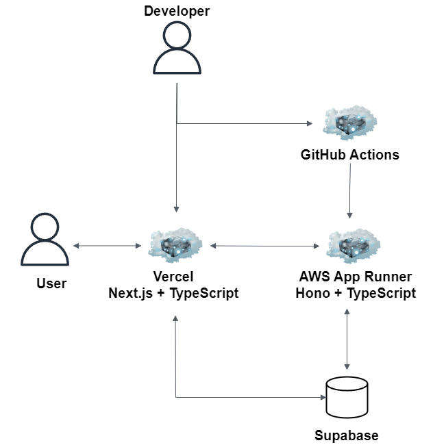

# 遠征Webアプリケーション概要(Frontend側)

## Summary

Todo

## Tech

### Frontend

-   TypeScript
-   Next.js
-   Hono
-   Supabase
-   vercel
-   jest
-   Playwright
-   eslint
-   prettier
-   GitHub Actions

### 参考(Backend)

-   TypeScript
-   Hono
-   AWS
    -   AWS App Runner
    -   ECR
-   Supabase
-   eslint
-   prettier
-   GitHub Actions

## Architecture

## Backend

リポジトリは以下となります。

-   [バックエンド](https://github.com/kojikawazu/nextjs-hono-back-travel-app)

## URL

-   [Vercel](https://vercel.com/)

-   [Next.js](https://nextjs.org/)

-   [Hono](https://hono.dev/)

-   [TypeScript](https://www.typescriptlang.org/)

-   [Supabase](https://supabase.com/)

-   [playwright](https://playwright.dev/)
